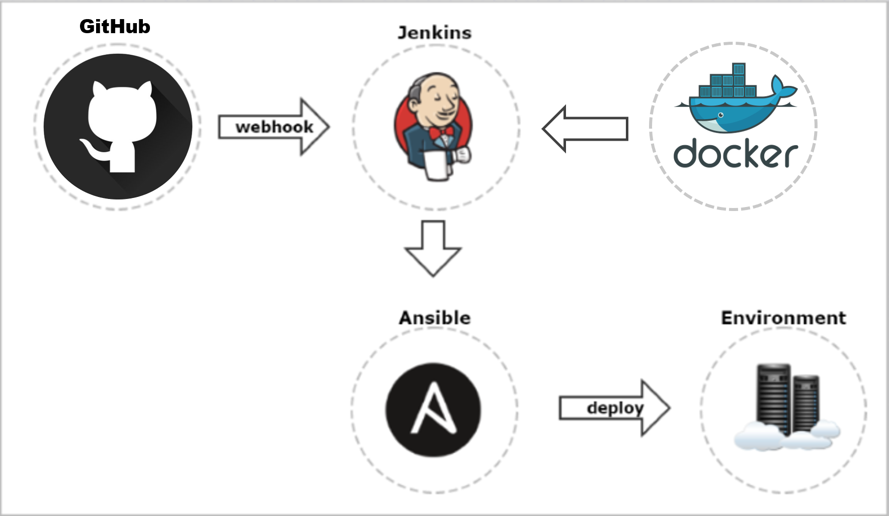

# workspace
# Random Generator Card App
Index
- **Brief**
-*My Intended Solution*
- **CI/CD Pipeline**
-*Pipeline*
- **Testing**
- **Deployment**
- **Technologies Used**
- **Front End Design**
- **Improvements for the Future**
- **Authors**
- **Acknowledgements**

**Brief** The objective of this project was to create an application with the utilisation of supporting tools, methodologies and technologies, covered within the training period. The scope of the project was to create a tracking board for user stories/use cases, an architecture consisting of 4 services working together with 2 different version implementations, have clear documentation alongside, risk assessment, adequate testing and deployment.

**Intended Solution** The intended solution was to make the game of blackjack/21. One service would pull random cards for the user and the 2nd service would pull for the house. The user would then either hit, stay or split depending on the cards. The back end/service 3 would then do all the maths and logic behind the game whilst getting the card data from the other 2. The final service is the frontend which would acts as a face for the application using bare minimum logic and just formatting. Once the winner was calculated the hand of cards would be added to the database and a leaderboard would be kept.
The final solution was a simpler game in which cards are drawn but highest card wins the game straight away. 

**CI/CD Pipeline:**

*Diagram:*

**Testing** The testing was intended to be done using pytest. This would be to test all basic functions to make sure product is able to be presented as the minimum viable product. Alongside the pytest, Selenium would be used to test the integration aspects of the app. The testing was started but was not completely for all factions of the code

**Deployment Technologies** Used The intended form of deployment incorporates Jenkins using docker images and swarm. Jenkins would go into the development and integration process, with each commit and push to git initiating a test and if successful being pushed online to be part of the functioning app. And the app then environment being set with ansible and then deployed.
Front-end Design The design was intended to just get the job done. It outputs all the important information whilst stating the rules.

**Improvements for Future** Currently the databases are still a problem for me, with it not functioning correctly. Also testing would be a large improvement. Other improvements include implementing testing and Continuous Integration methodology more thoroughly.
Changes I would make to the process of creating this project are to better structure my sprints and time spent on specific tasks. Focusing on key elements of the product that the end could not function without.

*Authors: Benjamin Asare*

Acknowledgments: God, The family, Jay, everybody

